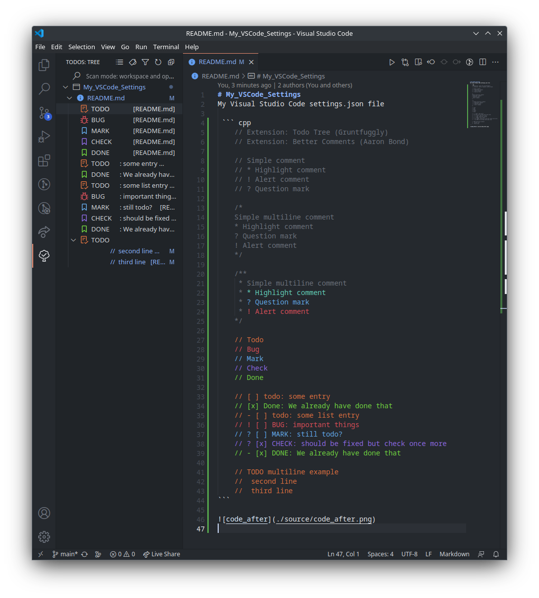

# My_VSCode_Settings
My Visual Studio Code settings.json file

 ``` cpp
    // Extension: Todo Tree (Gruntfuggly)
    // Extension: Better Comments (Aaron Bond)

    // Simple comment
    // * Highlight comment
    // ! Alert comment
    // ? Question mark

    /*
    Simple multiline comment
    * Highlight comment
    ? Question mark
    ! Alert comment
    */

    /**
     * Simple multiline comment
     * * Highlight comment
     * ? Question mark
     * ! Alert comment
    */

    // Todo
    // Bug
    // Mark
    // Check
    // Done

    // [ ] todo: some entry
    // [x] Done: We already have done that
    // - [ ] todo: some list entry
    // ! [ ] BUG: important things
    // ? [ ] MARK: still todo?
    // ? [x] CHECK: should be fixed but check once more
    // - [x] DONE: We already have done that

    // TODO multiline example
    //  second line
    //  third line
```


